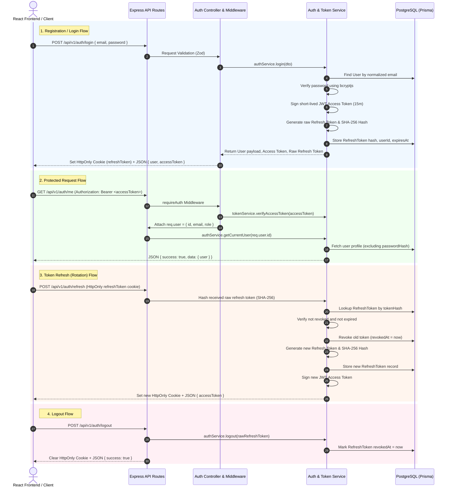

# Authentication & Authorization Architecture Documentation

This document describes the production-grade Authentication and Authorization architecture implemented in Part 4 for the AI-Powered E-Commerce DevOps Platform.

---

## 1. High-Level Architecture & System Flow

The system employs a stateless JSON Web Token (JWT) architecture for API request authentication, paired with stateful, hashed refresh-token database sessions stored in HttpOnly cookies for secure session management and token rotation.



---

## 2. Token Security & Refresh Strategy

### Access Tokens (JWT)
- **Lifetime**: 15 minutes (`JWT_ACCESS_TOKEN_EXPIRES_IN=15m`).
- **Signature Algorithm**: HS256 using `JWT_SECRET` from environment configuration.
- **Payload Claims**:
  ```json
  {
    "id": "usr_uuid",
    "email": "customer@example.com",
    "role": "CUSTOMER",
    "type": "access",
    "iat": 1700000000,
    "exp": 1700000900
  }
  ```
- **Security Rule**: Contains **no** passwords, `passwordHash`, connection strings, or sensitive data.

### Refresh Tokens & Session Storage
- **Lifetime**: 7 days (`JWT_REFRESH_TOKEN_EXPIRES_IN=7d`).
- **Storage Strategy**: Raw long-lived refresh tokens are **never** stored in plaintext.
- **Cryptographic Hash**: Raw token is hashed using SHA-256 before database insertion/lookup.
- **Database Schema**:
  ```prisma
  model RefreshToken {
    id        String    @id @default(uuid())
    userId    String
    tokenHash String    @unique
    expiresAt DateTime
    revokedAt DateTime?
    createdAt DateTime  @default(now())
    updatedAt DateTime  @updatedAt

    user User @relation(fields: [userId], references: [id], onDelete: Cascade)
  }
  ```
- **Token Rotation**: Every call to `POST /api/v1/auth/refresh` revokes the old refresh token record (`revokedAt = new Date()`) and creates a new token session, delivering a new HttpOnly cookie. Reusing a revoked token results in immediate rejection (HTTP 401).

---

## 3. Cookie Configuration

For browser compatibility and CSRF mitigation, refresh tokens are transmitted via HttpOnly cookies:

| Attribute | Setting | Description |
| :--- | :--- | :--- |
| `HttpOnly` | `true` | Prevents access via client-side JavaScript (`document.cookie`), mitigating XSS token theft. |
| `Secure` | `production ? true : false` | Enforces HTTPS transmission in production environments. |
| `SameSite` | `production ? 'strict' : 'lax'` | Mitigates Cross-Site Request Forgery (CSRF). |
| `Path` | `/api/v1/auth` | Restricts cookie transmission exclusively to authentication endpoints. |
| `Max-Age` | `604800` (7 days) | Matches refresh token expiration. |

*Note for non-browser HTTP clients/testing*: `/refresh` and `/logout` also support receiving `refreshToken` in request body as a fallback.

---

## 4. API Endpoints

### 1. User Registration
`POST /api/v1/auth/register`
- **Public access**.
- **Request Body**:
  ```json
  {
    "name": "John Doe",
    "email": "john@example.com",
    "password": "SecurePassword123!",
    "phone": "+1234567890"
  }
  ```
- **Password Policy**: Minimum 8 characters, maximum 100 characters, non-empty.
- **Default Role**: New registrations default strictly to `CUSTOMER`.
- **Response (201 Created)**:
  ```json
  {
    "success": true,
    "data": {
      "user": {
        "id": "8f03b519-74a4-4c4f-9e6b-e5b1285bf492",
        "name": "John Doe",
        "email": "john@example.com",
        "role": "CUSTOMER",
        "phone": "+1234567890",
        "createdAt": "2026-10-08T10:00:00.000Z",
        "updatedAt": "2026-10-08T10:00:00.000Z"
      },
      "accessToken": "eyJhbGciOiJIUzI1Ni..."
    }
  }
  ```

### 2. User Login
`POST /api/v1/auth/login`
- **Public access**.
- **Request Body**:
  ```json
  {
    "email": "john@example.com",
    "password": "SecurePassword123!"
  }
  ```
- **Error Behavior**: Returns generic `401 UNAUTHORIZED` with message `"Invalid email or password"` regardless of whether email exists or password failed.

### 3. Token Refresh
`POST /api/v1/auth/refresh`
- **Public access** (authenticated via HttpOnly cookie or body refresh token).
- **Response (200 OK)**:
  ```json
  {
    "success": true,
    "data": {
      "accessToken": "eyJhbGciOiJIUzI1Ni..."
    }
  }
  ```

### 4. Logout
`POST /api/v1/auth/logout`
- **Revokes active session in database** and clears HttpOnly refresh cookie.
- **Response (200 OK)**:
  ```json
  {
    "success": true,
    "data": {
      "message": "Logged out successfully"
    }
  }
  ```

### 5. Current Authenticated User
`GET /api/v1/auth/me`
- **Requires Auth**: `Authorization: Bearer <accessToken>`.
- **Response (200 OK)**:
  ```json
  {
    "success": true,
    "data": {
      "user": {
        "id": "8f03b519-74a4-4c4f-9e6b-e5b1285bf492",
        "name": "John Doe",
        "email": "john@example.com",
        "role": "CUSTOMER",
        "phone": "+1234567890",
        "createdAt": "2026-10-08T10:00:00.000Z",
        "updatedAt": "2026-10-08T10:00:00.000Z"
      }
    }
  }
  ```

---

## 5. Authorization & Roles

Authorization is enforced using `requireAuth` and `requireRole(...roles)` middleware.

### Status Code Distinction
- **HTTP 401 Unauthorized**: User is unauthenticated (missing, invalid, or expired Bearer token).
- **HTTP 403 Forbidden**: User is authenticated, but lacks required role privileges (e.g. `CUSTOMER` accessing `ADMIN` endpoint).

### Temporary Architecture Test Endpoint
- `GET /api/v1/admin/test`
- Requires: `requireAuth` + `requireRole("ADMIN")`.
- *Note*: Documented strictly as a temporary test endpoint for role authorization verification; not a business admin feature.

---

## 6. Error Codes Summary

| Error Code | HTTP Status | Trigger Condition |
| :--- | :--- | :--- |
| `VALIDATION_ERROR` | 400 Bad Request | Invalid input format (Zod validation failure) |
| `UNAUTHORIZED` | 401 Unauthorized | Missing/invalid access token, invalid credentials, or expired/revoked refresh token |
| `FORBIDDEN` | 403 Forbidden | Authenticated user lacks required role |
| `NOT_FOUND` | 404 Not Found | Requested endpoint or resource does not exist |
| `CONFLICT` | 409 Conflict | Email address already registered |
